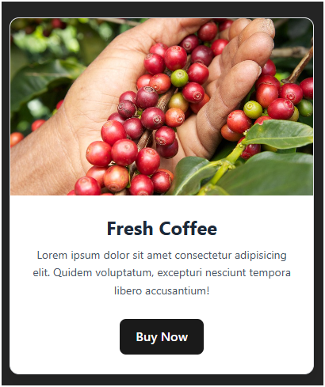

# Tailwind CSS 

## Tailwind CSS – What, Why & How to Use It

### What is Tailwind CSS?

**Tailwind CSS** is a **utility-first** CSS framework that lets you style your app directly in HTML/JSX using pre-defined classes — no more writing custom CSS!

Instead of:
```css
.heading { color: blue; font-size: 2rem; padding: 1rem; }
```
You write:
```html
<h1 class="text-blue-600 text-3xl p-4">Hello</h1>
```

**Result**: Faster development, consistent design, no context switching!

### Why Use Tailwind?

| Benefit                    | Explanation                                      |
|---------------------------|--------------------------------------------------|
| Super Fast Prototyping     | Style everything inline                          |
| No Custom CSS Needed       | 99% of designs possible with utilities           |
| Fully Responsive           | Built-in `sm:`, `md:`, `lg:`, `xl:` breakpoints  |
| Dark Mode Support          | Just add `dark:` prefix                          |
| Tiny Production Size       | Purges unused CSS → final file ~10KB             |
| Amazing Developer Experience | Auto-complete in VS Code + great docs         |

### How to Add Tailwind to Your React App (Create React App)

#### Step 1: Install Tailwind

```bash
npm install tailwindcss @tailwindcss/vite
```

#### Step 2: Configure `tailwind.config.js`

```js
import { defineConfig } from "vite";
import react from "@vitejs/plugin-react";
import tailwindcss from "@tailwindcss/vite";

// https://vite.dev/config/
export default defineConfig({
  plugins: [react(), tailwindcss()],
});

```

#### Step 3: Add Tailwind to CSS (`src/index.css` or `App.css`)

```css
@import "tailwindcss";
```

#### Step 4: Done! Start using classes

### Beautiful Card Component Using Tailwind (Live Example)

```jsx
iimport "./App.css";

function App() {
  return (
    <div className="min-h-screen p-8">
      <h1 className="text-4xl font-bold text-center text-blue-600 dark:text-sky-400 mb-10">
        Learn Tailwind CSS – It's Awesome!
      </h1>

      <div className="max-w-sm mx-auto bg-white border border-gray-200 rounded-xl shadow-lg overflow-hidden hover:shadow-xl transition-shadow duration-300">
        
        <div className="p-6">
          <h2 className="text-2xl font-bold text-gray-800 mb-2">Fresh Coffee</h2>
          <p className="text-gray-600 text-sm leading-relaxed">
            Lorem ipsum dolor sit amet consectetur adipisicing elit. Quidem
            voluptatum, excepturi nesciunt tempora libero accusantium!
          </p>
          <button className="mt-6 px-6 py-3 bg-blue-600 text-white font-medium rounded-lg hover:bg-blue-700 transition transform hover:scale-105">
            Buy Now
          </button>
        </div>
      </div>
    </div>
  );
}

export default App;

```



### Common Tailwind Classes Cheat Sheet

| Purpose               | Classes                                      |
|-----------------------|----------------------------------------------|
| Text Color            | `text-red-500`, `text-gray-800`              |
| Background            | `bg-blue-600`, `bg-white`                    |
| Padding / Margin      | `p-4`, `m-8`, `mt-6`, `mx-auto`              |
| Font Size             | `text-sm`, `text-xl`, `text-4xl`             |
| Font Weight           | `font-light`, `font-bold`, `font-semibold`   |
| Rounded Corners       | `rounded`, `rounded-lg`, `rounded-full`      |
| Shadow                | `shadow`, `shadow-md`, `shadow-xl`           |
| Hover Effects         | `hover:bg-gray-700`, `hover:scale-105`       |
| Responsive            | `md:text-2xl`, `lg:flex`, `sm:hidden`        |
| Dark Mode             | `dark:bg-black dark:text-white`              |

### Official Resources

- Website: https://tailwindcss.com  
- Docs: https://tailwindcss.com/docs  
- Playgrounds: https://play.tailwindcss.com  
- VS Code Extension: **Tailwind CSS IntelliSense** (auto-complete)

