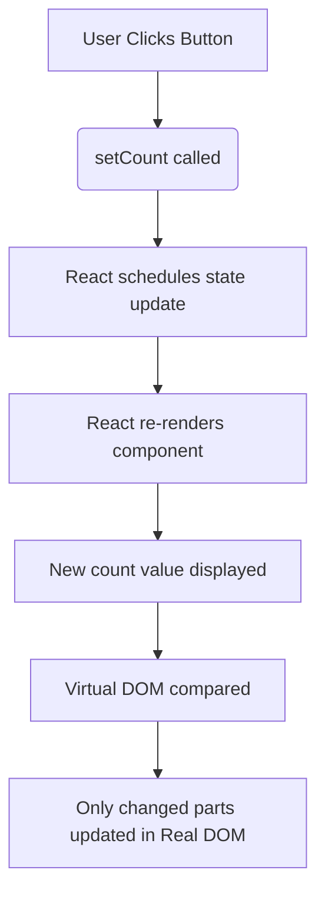
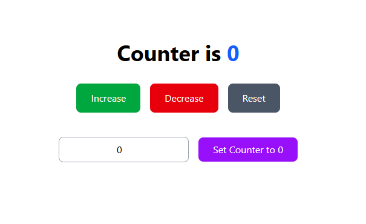

## Bun – The New Ultra-Fast JavaScript Runtime & Package Manager

### What is Bun?

**Bun** is an all-in-one JavaScript runtime, package manager, bundler, and test runner — designed to be a **faster drop-in replacement** for Node.js + npm/yarn/pnpm.

Created by **Jarred Sumner** (ex-Shopify), launched in 2023, now one of the hottest tools in 2025!

### Key Features (Why Everyone is Switching)

| Feature                | Bun                             | npm/yarn/pnpm                  |
|------------------------|----------------------------------|--------------------------------|
| Speed                  | 4–10x faster installs           | Slow (especially cold start) |
| Package Manager        | Built-in (`bun add`, `bun install`) | Needs npm/yarn/pnpm          |
| Runtime                | Replaces Node.js                | Needs Node.js                 |
| Bundler                | `bun build` (like Vite/Webpack) | Needs extra tools             |
| TypeScript             | Native support (no ts-loader)   | Needs config                  |
| JSX                    | Built-in                        | Needs Babel                   |
| Startup Time           | ~10ms                           | ~300ms+                       |

### How to Use Bun

#### 1. Install Bun (One Command)

```bash
curl -fsSL https://bun.sh/install | bash
```

#### 2. Basic Commands (Same as npm, but faster!)

| npm/yarn/pnpm               | Bun Equivalent                     | Speed Difference       |
|--------------------------------|------------------------------------|------------------------|
| `npm install`                  | `bun install`                      | 10–30x faster          |
| `npm install react`            | `bun add react`                    | Instant                |
| `npm remove lodash`            | `bun remove lodash`                | Super fast             |
| `npm run dev`                  | `bun run dev` or just `bun dev`    | Built-in dev server    |
| `npm run build`                | `bun build ./index.tsx --outdir dist` | No config needed    |

#### 3. Create a New Project (Zero Config!)

```bash
bun create vite
cd my-app
bun dev        # Starts dev server at http://localhost:5173
```

Works with React, Next.js, Vite, Express, etc. — **no config needed!**

### Bun vs npm – Real Comparison

| Task                        | npm / yarn / pnpm         | Bun                            |
|-----------------------------|----------------------------|--------------------------------|
| Install dependencies        | 15–60 seconds              | 1–5 seconds                    |
| Cold start (`npm run dev`)  | 1–3 seconds                | < 50ms                         |
| Run script                  | `node index.js`            | `bun index.js` (4x faster)     |
| Bundle for production       | Needs Webpack/Rollup      | `bun build` built-in           |


---


# React State & Hooks 

### What is State in React?

**State** is a way to make a component **"remember"** data and **re-render** when that data changes.

```text
State Changes → React Re-renders Component → UI Updates
```

### How State Works – Behind the Scenes (Diagram)



### React Hooks – What Are They?

**Hooks** let you use state and lifecycle features in **functional components**.

Introduced in React 16.8 (2019) → Now the **standard way** to write React!

### Most Important Hooks

| Hook             | Use Case                              | Syntax Example                            |
|------------------|----------------------------------------|--------------------------------------------|
| `useState`       | Add state to component                 | `const [count, setCount] = useState(0)`   |
| `useEffect`      | Run side effects (API, subscriptions) | `useEffect(() => {...}, [deps])`          |
| `useContext`     | Access global state                    | `const theme = useContext(ThemeContext)`  |
| `useRef`         | Access DOM or persist values           | `const inputRef = useRef()`               |
| `useReducer`     | Complex state logic                    | `const [state, dispatch] = useReducer(...)` |

### Full useState Counter Example (With Explanation)

```jsx
import { useState } from "react";
import "./App.css";

export default function App() {
  // Declare state variables
  const [count, setCount] = useState(0);        // Main counter
  const [userCount, setUserCount] = useState(0); // For input

  return (
    <>
      <h1 className="text-4xl font-bold text-center my-8">
        Counter is <span className="text-blue-600">{count}</span>
      </h1>

      <div className="text-center space-x-4">
        <button
          className="px-6 py-3 bg-green-600 text-white rounded-lg hover:bg-green-700"
          onClick={() => setCount(prev => prev + 1)}
        >
          Increase
        </button>

        <button
          className="px-6 py-3 bg-red-600 text-white rounded-lg hover:bg-red-700"
          onClick={() => setCount(prev => Math.max(prev - 1, 0))}
        >
          Decrease
        </button>

        <button
          className="px-6 py-3 bg-gray-600 text-white rounded-lg hover:bg-gray-700"
          onClick={() => setCount(0)}
        >
          Reset
        </button>
      </div>

      <div className="text-center mt-10">
        <input
          type="number"
          value={userCount}
          onChange={(e) => setUserCount(Number(e.target.value) || 0)}
          className="px-4 py-2 border border-gray-400 rounded-lg text-center"
          placeholder="Enter number"
        />
        <button
          className="ml-4 px-6 py-2 bg-purple-600 text-white rounded-lg hover:bg-purple-700"
          onClick={() => {
            setCount(userCount);
            setUserCount(0); // Clear input
          }}
        >
          Set Counter to {userCount}
        </button>
      </div>
    </>
  );
}
```

### Key Rules of useState

| Rule                                | Correct                                  | Wrong                                   |
|-------------------------------------|------------------------------------------|-----------------------------------------|
| Never mutate state directly         | `setCount(prev => prev + 1)`             | `count++` or `count = count + 1`        |
| Always use updater function for prev value | `setCount(c => c + 1)`               | `setCount(count + 1)` (can be stale)    |
| State updates are asynchronous      | React batches them for performance       | Don't rely on immediate change          |

---
[](./src/assets/counter.mp4)

