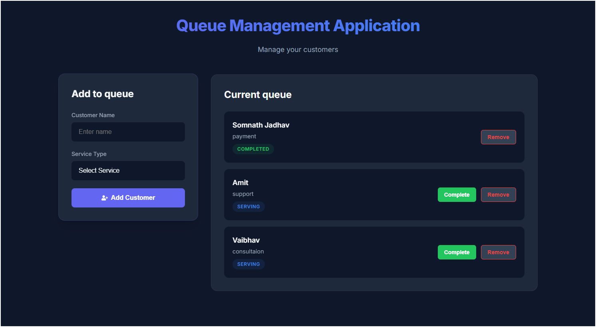

# Queue Management System 
A beautiful, fast, and super-intuitive **Queue Management System** built with React – perfect for clinics, banks, support desks, or any place where people wait in line (and hate waiting!).

This isn't just another boring list – it's a **premium-feeling**, animated, glassmorphic web app that makes managing queues actually fun!

## Live Preview (What It Actually Looks Like)

  
*Smooth animations, dark glass UI, real-time updates – your customers will think it's magic!*

## Features That Actually Matter

| Feature                        | Why You'll Love It                                                                 |
|-------------------------------|-------------------------------------------------------------------------------------|
| Add Customer Instantly        | Just type name + choose service → boom, they're in line                            |
| Live Queue Display            | See everyone waiting, being served, or done – updated in real-time                 |
| Smart Status Flow             | Waiting → Serving → Completed (with color-coded badges)                      |
| One-Click Actions             | Serve Next, Mark as Done, or Remove – no confusion                                 |
| Fully Responsive              | Looks perfect on phones, tablets, and big screens                                   |
| Smooth Animations             | New customers slide in, completed ones fade out – feels premium                     |
| Dark Glassmorphism Design     | Modern, clean, professional – your brand will look high-end                         |

## How It Works – Simple Flow Diagram

```mermaid
graph TD
    A[User fills form] --> B[Submit]
    B --> C[New customer added to queue]
    C --> D[State updates in App.jsx]
    D --> E[QueueDisplay re-renders]
    E --> F[New card slides in with animation]

    G[Click "Serve"] --> H[Status → Serving (Blue)]
    I[Click "Complete"] --> J[Status → Completed (Green)]
    K[Click "Remove"] --> L[Customer disappears with fade]

    style A fill:#6366f1, color:white, stroke:#4f46e5
    style F fill:#10b981, color:white, stroke:#059669
    style H fill:#3b82f6, color:white
    style J fill:#10b981, color:white
    style L fill:#ef4444, color:white
```

## Real-World Use Cases

- Doctor clinics & hospitals
- Government service counters
- Bank customer service
- Mobile repair shops
- College admission desks
- Food court ordering systems

## Tech Stack (Modern & Fast)

| Technology       | Purpose                                      |
|------------------|----------------------------------------------|
| React 19 + Vite  | Blazing fast development & builds            |
| CSS     | Beautiful, responsive, no custom CSS hell    |
| Framer Motion    | Smooth slide/fade animations                 |
| Lucide Icons     | Clean, modern icons                          |
| UUID             | Unique IDs for each customer                 |
|bun package   |For fast package installation
---

## How Data Flows (Easy Explanation)

```
You type → Form captures input
        ↓
App.jsx (The Brain) holds all customers in state
        ↓
QueueDisplay receives the list + action buttons
        ↓
Click "Serve" → App updates that customer's status
        ↓
Whole UI instantly updates – no page reload!
```

It’s **unidirectional flow** – clean, predictable, and React’s best practice!

## Setup in 30 Seconds

```bash
clone Repo
cd queue-management
npm install or bun install
npm run dev or bun dev
```


## Want to Customize?

Easy! Just edit:

- Colors → `src/index.css` (CSS variables)
- Services → `QueueForm.jsx` (dropdown options)
- Add sound/notification → just import and trigger on status change
---